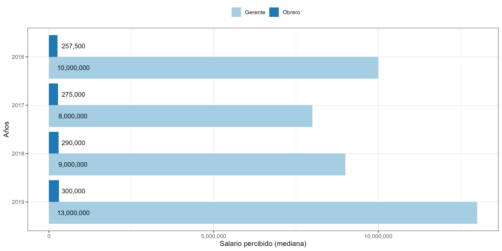

layout: true
class: animated, fadeIn

---
class: slideInRight, center, middle

```{r include=FALSE, cache = FALSE}
library(RefManageR)
bib <- ReadBib("../input/bib/seminario-elsoc.bib")
```

# Antecedentes 

---

# Legitimidad de la desigualdad

**Legitimación Subjetiva:** Esta dimensión se refiere a la consideración de las **creencias** en sí mismas en el sentido weberiano, pero enfatizando un aspecto central que dice relación con la capacidad de **justificación.** `r Cite(bib, c("Castillo2012-multidimentional"))`

* Lo anterior implica una referencia a estándares normativos de justicia, es decir, una evaluación de **"lo que es"** respecto de **"lo que debería ser"**. `r Cite(bib, c("Castillo2012-multidimentional","Wegener1987"))`

---
# Evidencia

* El estudio de la percepción y justificación de desigualdad económica empleando mediciones "indirectas" a través de salarios según ocupaciones `r Cite(bib, c("Kelley1993","Osberg2006"))`

* Estudios transversales han demostrado que la percepción predice fuertemente la justificación de desigualdad  `r Cite(bib, c("Castillo2011","Castillo2012","Schroder2017_soc_jus"))`

* Evidencia experimental ha demostrado que la desigualdad percibida incrementa la brecha justa `r Cite(bib, c("Trump2017"))`
* Para el caso de Chile, se ha evidenciado una disminución de las brechas percibidas y justas en 20 años, Pero una persistente asociación positiva entre brecha percibida y justa `r Cite(bib, c("Castillo-etal-2019"))`

---
class: middle, center 
#_¿De qué manera la percepción de desigualdad actual influencia la justificación de desigualdad futura?_
---
# Hipótesis

* $H_1$: La percepción de desigualdad presente se asocia positivamente con la justificación de desigualdad presente.   

* $H_2$: La percepción de desigualdad actual influencia la justificación de desigualdad futura. No así la justificación actual con la pecepción de desigualdad futura.

* $H_3$: La influencia de la desigualdad percibida sobre la justificación de desigualdad es moderada por el tiempo. 
 
---
# Datos

* Se emplearon datos de las mediciones 2016, 2017, 2018 y 2019 del Estudio Social Longitudinal de Chile (ELSOC).


|Ola  | Según año |   Longitudinal|
|:----|----:      |----:          |
|2016 | 2535      | 1220          |
|2017 | 2064      | 1220          |
|2018 | 1992      | 1220          |
|2019 | 1818      | 1220          |

* Los resultados presentados corresponden a la base longitudinal (sujetos constantes por cada medición)

---
background-image: url(../output/images/items_elsoc.png)   
background-size: contain

# Variables principales
<br>
<br>
<br>
<br>
<br>
<br>
<br>
<br>
<br>


$$\text{Brecha salarial} = \ln\Bigg(\frac{\text{Salario Gerente}}{\text{Salario Obrero}}\Bigg)$$

---
# Métodos

* Análisis de regresión panel Cross-lagged y Modelos Multinivel.
* Tanto las variables de percepción y de justificación se predicen en función de la medición anterior, además, se estiman "efectos" cruzados entre mediciones.
.center[]   

---
class: top, middle

## Resultados 1:
# Análisis descriptivo

---
# Salario percibido 
  

---
# Salario justo 
  

---
# Brecha salarial  
  

---
class: center, middle
  

---
class: top, middle 
## Resultados 2:
# Análisis longitudinal (1)
---
class: top, left
background-image: url(../output/images/sempath02b.png)  
background-size: contain

.small[n = 1220]
---
class: top, middle 
## Resultados 3:
# Análisis longitudinal (2)
---
class: middle, left
.left-column[
## Modelos Multinivel


]
.right-column[
 
]  
    

---
class: inverse
# Conclusiónes preliminares

* La percepción es persistente en su asociación con la justificación de desigualdad.

* La brecha salarial percibida presente no muestra una asociación fuerte con la brecha justa futura, salvo entre medición 2016 y 2017. 

* El transcurso del tiempo muestra una asociación no lineal sobre la justificación.

* La asociación entre percepción y justificiación se ve afectado negativamente por el tiempo. La asociación se vuelve más débil en los años recientes.
 
---
class: center, middle

# _**Dinámicas de legitimación: Percepción de desigualdad actual y justificación de desigualdad futura**_

---
class: inverse, tiny 

```{r echo=FALSE, results='asis'}
PrintBibliography(bib, start = 1, end = 4)
```

---
class: inverse, tiny 

```{r echo=FALSE, results='asis'}
PrintBibliography(bib, start = 5, end = 9)
```
---
class: center, middle

.center-align[ 
Cómo citar:
> Iturra, J. C., & Castillo, J. C. (2020, July 18). Dinámicas de legitimación: Percepción de desigualdad actual y justificación de desigualdad futura. Retrieved from osf.io/4gyz3
]


.center-b[ #[`r  fontawesome::fa(name = "github", fill = "black")` <br> jciturras/dinamic-legit  ](https://github.com/jciturras/dinamic-legit)]
---
class: center, middle

Presentación creada via la librería de R [**xaringan**](https://github.com/yihui/xaringan).

Además de [remark.js](https://remarkjs.com), [**knitr**](http://yihui.name/knitr), y [R Markdown](https://rmarkdown.rstudio.com).


